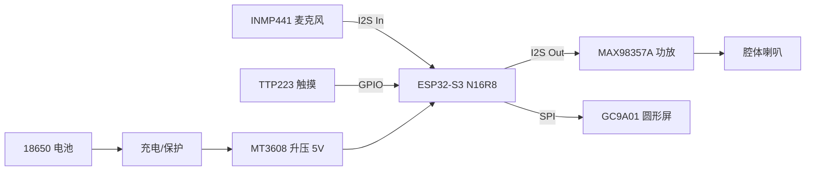

# Wallace：拟人化桌面 AI 机器人

> 目标：构建一个具备“听、说、看”能力的桌面语音助手。
> 架构升级：由 STM32 + ESP8266 分体方案升级为 **ESP32-S3（N16R8）** 单芯片全栈方案。

## 目录
- [1. 项目概述](#1-项目概述)
- [2. 系统架构](#2-系统架构)
    - [2.1 硬件链路](#21-硬件链路)
    - [2.2 数据流向](#22-数据流向)
- [3. 硬件设计与引脚规划](#3-硬件设计与引脚规划)
    - [A. 音频输入（INMP441 - I2S）](#a-音频输入inmp441---i2s)
    - [B. 音频输出（MAX98357A - I2S）](#b-音频输出max98357a---i2s)
    - [C. 视觉显示（GC9A01 - SPI）](#c-视觉显示gc9a01---spi)
    - [D. 交互与存储](#d-交互与存储)
- [4. 软件实现路线](#4-软件实现路线)
    - [4.1 固件端（ESP32-S3）](#41-固件端esp32-s3)
    - [4.2 服务端（PC / 本地服务器）](#42-服务端pc--本地服务器)
- [5. 电源管理策略](#5-电源管理策略)
- [6. 硬件采购清单（BOM）](#6-硬件采购清单bom)

---

## 1. 项目概述

**核心体验**：
- **听**：按住触摸键说话，实时采集语音。
- **看**：圆形屏幕模拟眼睛，具备眨眼、注视、思考（波形律动）等拟人化表情。
- **说**：本地电脑（服务端）处理后回传音频播放。
- **续航**：电池供电，支持低功耗待机。

---

## 2. 系统架构

### 2.1 硬件链路

### 2.2 数据流向

1. **唤醒**：触摸 TTP223 → ESP32 唤醒 → 屏幕显示“聆听”状态。
2. **上行**：ESP32 通过 I2S 读取麦克风 → 压缩/透传 → Wi-Fi（WebSocket）→ PC 服务端。
3. **处理（PC 端）**：
     - ASR（Faster-Whisper）转文字
     - LLM（Ollama / DeepSeek）生成回复
     - TTS（Edge-TTS / Piper）生成音频
4. **下行**：服务端推送音频流 → ESP32 接收缓存 → I2S 功放播放 → 屏幕显示“说话”动效。

---

## 3. 硬件设计与引脚规划

以下为 **ESP32-S3 DevKit** 推荐引脚分配（可按实际布线调整）：

### A. 音频输入（INMP441 - I2S）

- **SCK (BCLK)**：GPIO 41
- **WS (LRC)**：GPIO 42
- **SD (DIN)**：GPIO 2
- **VDD / GND**：3.3V / GND
- **L/R**：接地（单声道模式）

### B. 音频输出（MAX98357A - I2S）

- **BCLK**：GPIO 15
- **LRC**：GPIO 16
- **DIN**：GPIO 17
- **Vin / GND**：**5V** / GND（接 5V 声音更大）

### C. 视觉显示（GC9A01 - SPI）

- **SCL (SCK)**：GPIO 12
- **SDA (MOSI)**：GPIO 11
- **RES (RST)**：GPIO 10
- **DC**：GPIO 9
- **CS**：GPIO 46（或任意空闲）
- **BLK**：GPIO 45（背光控制，可选）
- **VCC / GND**：3.3V / GND

### D. 交互与存储

- **触摸按键（TTP223）**：GPIO 1（任意输入引脚）
- **SD 卡（可选）**：SPI 接口（MISO / MOSI / CLK / CS），可复用屏幕 SPI 或单独定义

---

## 4. 软件实现路线

### 4.1 固件端（ESP32-S3）

- **开发环境**：PlatformIO（Arduino Framework）或 ESP-IDF
- **关键库推荐**：
    - `TFT_eSPI` 或 `LovyanGFX`：驱动 GC9A01，支持高帧率刷新
    - `ESP-ADF` 或 `Arduino-Audio-I2S`：处理 I2S 音频流
    - `WebSocketsClient`：与电脑保持长连接
- **拟人化逻辑**：
    - 使用“局部刷新”或 Sprite 技术绘制眼睛，避免全屏刷新闪烁
    - 播放音频时做简易 FFT 计算音量，控制嘴巴/波形振幅

### 4.2 服务端（PC / 本地服务器）

- **技术栈**：Python（FastAPI + WebSocket）
- **Pipeline**：
    1. **VAD（静音检测）**：判断用户是否说完
    2. **ASR**：`faster-whisper`（推荐 large-v3-turbo）
    3. **Agent**：`LangChain` + `Ollama`（调用 Llama3 或 DeepSeek-R1）
    4. **TTS**：`edge-tts`（免费、自然）或 `CosyVoice`（更好但需显卡）

---

## 5. 电源管理策略

- **供电路径**：单节 18650（3.7V–4.2V）→ TP4056（充电保护）→ MT3608（升压至 5V）
- **5V 用途**：供给 MAX98357A 功放（更大推力）与 ESP32 开发板 `5V` 输入（板载 LDO 转 3.3V）
- **低功耗**：
    - 无交互 30 秒：关闭屏幕背光，Wi-Fi 进入 Modem Sleep，CPU 降频
    - 仅保留触摸按键 GPIO 唤醒

---

## 6. 硬件采购清单（BOM）

**按以下清单采购（已含冗余量）**：

| 模块类别 | 硬件名称 | 规格备注（关键点） | 数量 | 作用 |
| --- | --- | --- | --- | --- |
| 主控（大脑） | ESP32-S3 开发板 | N16R8（16M Flash / 8M PSRAM），Type-C | 2 | 核心处理，双核 + AI 加速 |
| 显示（眼睛） | 1.28 寸 GC9A01 屏幕 | 圆形 LCD，SPI，带 PCB 底板 | 1 | 拟人化交互显示 |
| 听觉（输入） | INMP441 麦克风 | I2S 全向麦克风 | 2 | 语音采集 |
| 说话（输出） | MAX98357A 功放 | I2S 接口，3W D 类 | 2 | 驱动喇叭 |
| 说话（发声） | 腔体喇叭 | 4Ω 3W，带音腔外壳 | 1 | 播放声音 |
| 电源（电池） | 18650 电池 + 盒 | 容量 2500mAh+ | 1 组 | 系统供电 |
| 电源（充电） | TP4056 充电模块 | Type-C，带电池保护 | 2 | 充电与保护 |
| 电源（稳压） | MT3608 升压模块 | 2A DC-DC，5V 输出 | 2 | 电池升压 |
| 交互（按键） | TTP223 触摸模块 | 电容式点动 | 2 | 唤醒/按住说话 |
| 存储（可选） | Micro SD 卡模块 | SPI 接口 | 1 | 本地素材存储 |
| 耗材 | 杜邦线/排针 | 公对母、母对母等 | 1 批 | 连接调试 |
| 开关 | 拨动/船型开关 | 小型（如 SS12D00） | 5 | 总电源通断 |

**采购提示**：
1. ESP32-S3 必须确认内存规格为 N16R8，否则难以支撑复杂动画。
2. 屏幕务必购买带排针底板版本，裸屏不易手工焊接。
3. 喇叭要带音腔，否则音量与音质明显不足。